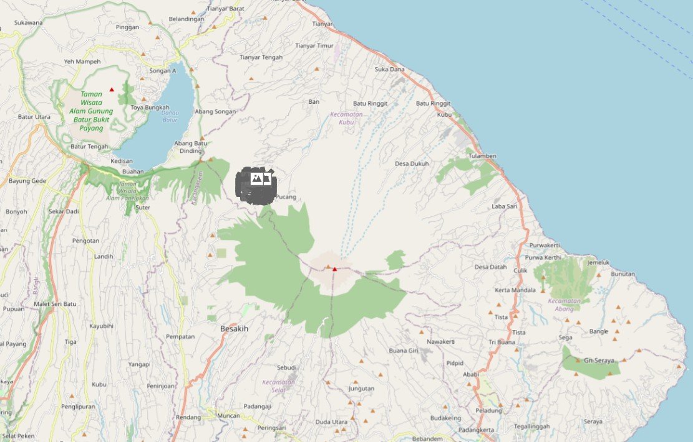
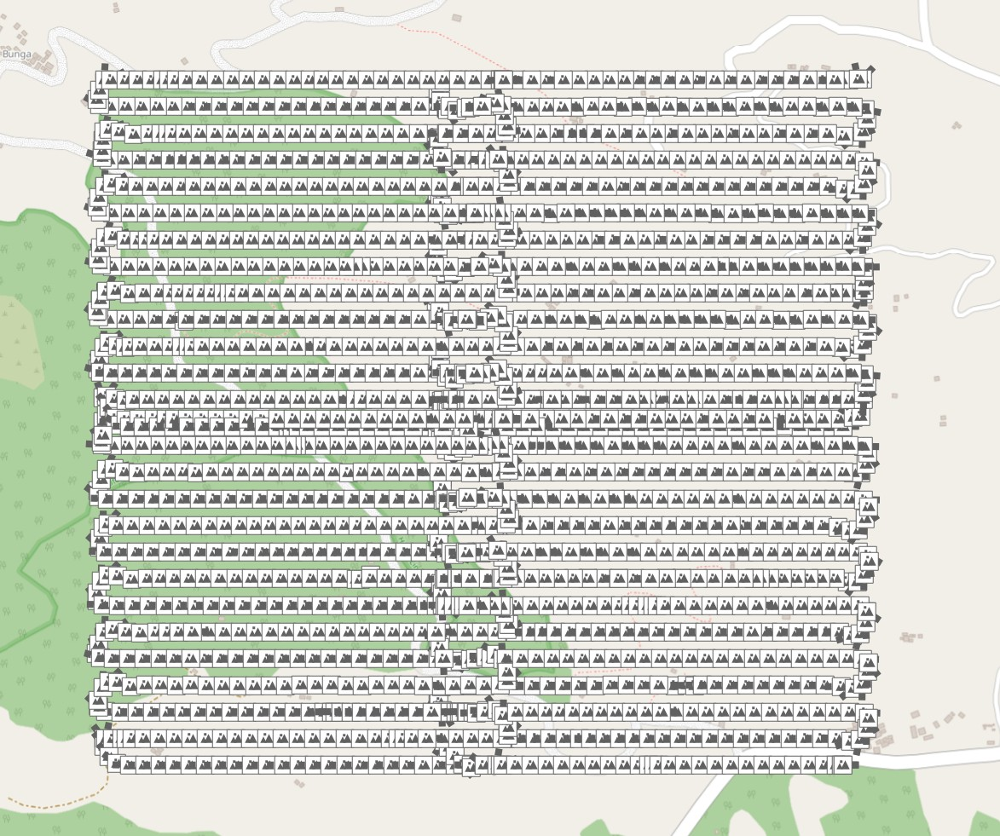

# Drone Test Data Mt Agung 2





View the AOI on a map [here](./aoi.geojson).

## Contents

- Images of Mt Agung, Bali, Indonesia.
  - Images are from adjacent tasks, allowing for processing in ODM.
  - As they are too large to store in Git, a link to S3 is provided instead.
- A GeoJSON AOI of the area.
- QGIS project to load and visually inspect.
- Images geopackage, to display inside QGIS easily.
- Image metadata CSV extracted via `exiftool`.

View the AOI on a map [here](./aoi.geojson).

## Imagery Source

DroneTM project:
- `images/task-nw`: https://dronetm.org/projects/a93e99f5-5aab-4316-b6f8-0acd56975df3/tasks/8a8ca7b0-e786-4d0a-a7ab-45d16665bc41
- `images/task-ne`: https://dronetm.org/projects/a93e99f5-5aab-4316-b6f8-0acd56975df3/tasks/7dd0b8fb-8f5f-4075-88c0-d6e1cbf7f1a9
- `images/task-sw`: https://dronetm.org/projects/a93e99f5-5aab-4316-b6f8-0acd56975df3/tasks/9a1992ad-e79e-4908-9465-ec0e1b96abb7
- `images/task-se`: https://dronetm.org/projects/a93e99f5-5aab-4316-b6f8-0acd56975df3/tasks/6874ce55-fee4-4ea8-8e76-e32583c1bfeb

## Intentional Errors

- The imagery has a few intentional errors to be caught by DroneTM processing.
- As a result I would not recommend processing via tools like ODM, without
  first removing these files (i.e. by passing into DroneTM).
- Some have invalid EXIF, others blurry photos, or are simply black (indicating lens cap left on).
- These files are denoted by `_ISSUE_WITH_FILE.JPG`.
- The files are separated into the directory `images/issues`.

## Example Image


All imagery is licensed as CC-BY-4.0.

## Dataset Creation Process

First I downloaded the imagery from the DroneTM S3 bucket, and divided the
four tasks into the NE / NW / SE / SW directories.

### Adding Some Invalid Data

1. Extract EXIF (and inspect the output EXIF tags):

```bash
exiftool -csv \
  -FileName \
  -DateTimeOriginal \
  -GPSLatitude \
  -GPSLongitude \
  -AbsoluteAltitude \
  -GimbalPitchDegree \
  -CameraPitch \
  -FlightYawDegree \
  ./images/* > image_metadata.csv
```

2. Make a few file duplicates with `_DUP.JPG` appended.

3. Make a few file copies and rename with `_GIMBAL_UP.JPG` appended, then set their gimbal pitch and degree to point upwards (simulating accidental gimbal movement during transitions):

```bash
exiftool -overwrite_original \
  -GimbalPitchDegree=+30 \
  -CameraPitch=+30 \
  *_GIMBAL_UP.JPG
```

4. Make a few file copies and rename with `_GIMBAL_HORIZON.JPG` appended, then set their gimbal angle to 0 (horizon shot):

```bash
exiftool -overwrite_original \
  -GimbalPitchDegree=0 \
  -CameraPitch=0 \
  *_GIMBAL_HORIZON.JPG
```

5. Make a few file copies and rename with `_FAR_AWAY.JPG` appended, then apply a lat+lon that is far away from AOI:

```bash
exiftool -overwrite_original \
  -GPSLatitude=48.8566 \
  -GPSLatitudeRef=N \
  -GPSLongitude=2.3522 \
  -GPSLongitudeRef=E \
  *_FAR_AWAY.JPG
```

6. Make a few file copies and rename with `_INVALID_COORD.JPG` appended, then apply a lat+lon that is invalid:

```bash
exiftool -overwrite_original \
  -GPSLatitude=250.0 \
  -GPSLatitudeRef=N \
  -GPSLongitude=325 \
  -GPSLongitudeRef=W \
  *_INVALID_COORD.JPG
```

7. Make a few file copies and rename with `_MISSING_COORDS.JPG` appended, then apply empty location info:

```bash
exiftool -overwrite_original \
  -GPSLatitude= \
  -GPSLatitudeRef= \
  -GPSLongitude= \
  -GPSLongitudeRef= \
  *_MISSING_COORDS.JPG
```

8. Make a few file copies and change to an entirely black image via min brightness, min exposure, max contrast, re-apply the EXIF, then tweak the coord slightly:

```bash
exiftool -overwrite_original \
  -TagsFromFile FILENAME.JPG \
  -AbsoluteAltitude \
  -GimbalPitchDegree \
  -FlightYawDegree \
  FILENAME_LENS_CAP.JPG

exiftool -overwrite_original \
  -GPSLatitude="-8.303950" \
  -GPSLongitude="115.484150" \
  -GPSLatitudeRef=S \
  -GPSLongitudeRef=E \
  FILENAME_LENS_CAP.JPG
```

9. Make a few file copies and change sharpness / blur, re-apply the EXIF, then tweak the coord slightly:

```bash
exiftool -overwrite_original \
  -TagsFromFile FILENAME.JPG \
  -AbsoluteAltitude \
  -GimbalPitchDegree \
  -FlightYawDegree \
  FILENAME_POOR_SHARPNESS.JPG

exiftool -overwrite_original \
  -GPSLatitude="-8.303950" \
  -GPSLongitude="115.484150" \
  -GPSLatitudeRef=S \
  -GPSLongitudeRef=E \
  FILENAME_POOR_SHARPNESS.JPG
```

10. Make a few file copies and rename with `_MISSING_GIMBAL.JPG` appended, then remove gimbal angle metadata entirely (should be marked invalid downstream):

```bash
# This does not work, as the EXIF is permanently encoded
# exiftool -overwrite_original \
#   -GimbalPitchDegree= \
#   -CameraPitch= \
#   *_MISSING_GIMBAL.JPG

# Instead make a file copy and save in your OS photo browser
# This will likely erase the EXIF - double check with exiftool
```

> [!NOTE]
> Errors like  
> `Warning: [minor] Possibly incorrect maker notes offsets (fix by -456?) - DJI_20251027143608_0008_D_LENS_CAP.JPG`  
> are absolutely fine. They reference proprietary MakerNotes, which we don't need.

### Uploading To S3

```bash
docker run --rm -it --entrypoint=sh -v "/home/YOURUSER/rclone.conf:/config/rclone/rclone.conf" -v "$(pwd)/images:/images" rclone/rclone:latest

rclone sync --verbose /images dronetm-testdata:dronetm-testdata/agung-2
```

### Downloading From S3

```bash
docker run --rm -it --entrypoint=sh -v "/home/YOURUSER/rclone.conf:/config/rclone/rclone.conf" -v "$(pwd)/images:/images" rclone/rclone:latest

rclone sync --verbose dronetm-testdata:dronetm-testdata/agung-2 /images
```
